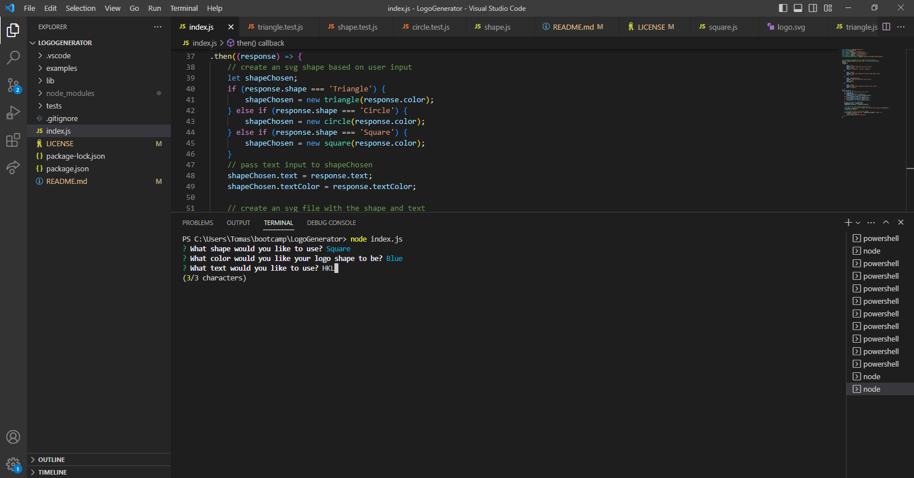
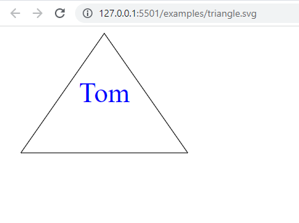

# Command Line Logo Generator

## Description

This is a simple Command Line application that generates a logo.svg file for the user based on their inputs. The application uses a simple 4 step process to gather a few pieces of input and from that generate a logo.svg file. I have written this application using Javascript and used the help of Jest and Inquirer to construct the logic and prompts. Through this application I gained a better understanding of generating svg files using the draw module and how to path the data to an image file. Using Jest I learned to test my code during development and make sure each function was working as intended. Using Inquirer I further learned on its capabilities and how to use it to create a simple command line application.

## Table of Contents 

If your README is long, add a table of contents to make it easy for users to find what they need.

- [Installation](#installation)
- [Usage](#usage)
- [Credits](#credits)
- [License](#license)

## Installation

A few steps to get your application up and running: 

-Head to: https://github.com/TamasPinter/LogoGenerator and clone the repository to your machine. 

-Open the repository in your code editor. 

-Open your integrated terminal and run the command: npm install 

-Once your dependencies have been installed, follow to the Usage section to learn about how the app runs. 

## Usage

To use the application, run the command: "node index.js" in your command line. From here, you will be prompted for a few questions.

-First select your choice from the shapes provided for your logo.

-Next, enter a color you would like for your shape. NOTE: you may use base colors such as red, blue, teal, green, black, white, etc or you may use hex codes such as #000000, #ffffff, #ff0000, etc.

-Next, enter a 3 letter word/abbreviation for your logo. This text will appear at the center of your logo.

-Next, enter a color for your text. Note: Same inputs as for shape color here.

-Once all 4 prompts are completed, your logo will be generated and saved in the examples folder as logo.svg.

You may also run the command: "npm test" to make sure all functions are passing and generating their content correctly. The shape class is designed to fail on it's own as it has no specified shape input to generate, however the 3 shape classes (square, circle, triangle) are designed to pass their tests.

.

A video link as well: https://drive.google.com/file/d/14pl64xCInD4LOv9mRZuJO06qxNiHT1zP/view

## Credits

- [Inquirer](https://www.npmjs.com/package/inquirer)
- [Jest](https://www.npmjs.com/package/jest)

Please visit my GitHub profile to see more of my work:
- [TamasPinter](https://github.com/TamasPinter)

And also feel free to Email me any questions you may have:
- [TamasPinter](mailto:brolli_673@hotmail.com)

## License

MIT License

Copyright (c) 2023 TamasPinter

Permission is hereby granted, free of charge, to any person obtaining a copy
of this software and associated documentation files (the "Software"), to deal
in the Software without restriction, including without limitation the rights
to use, copy, modify, merge, publish, distribute, sublicense, and/or sell
copies of the Software, and to permit persons to whom the Software is
furnished to do so, subject to the following conditions:

The above copyright notice and this permission notice shall be included in all
copies or substantial portions of the Software.

THE SOFTWARE IS PROVIDED "AS IS", WITHOUT WARRANTY OF ANY KIND, EXPRESS OR
IMPLIED, INCLUDING BUT NOT LIMITED TO THE WARRANTIES OF MERCHANTABILITY,
FITNESS FOR A PARTICULAR PURPOSE AND NONINFRINGEMENT. IN NO EVENT SHALL THE
AUTHORS OR COPYRIGHT HOLDERS BE LIABLE FOR ANY CLAIM, DAMAGES OR OTHER
LIABILITY, WHETHER IN AN ACTION OF CONTRACT, TORT OR OTHERWISE, ARISING FROM,
OUT OF OR IN CONNECTION WITH THE SOFTWARE OR THE USE OR OTHER DEALINGS IN THE
SOFTWARE.
